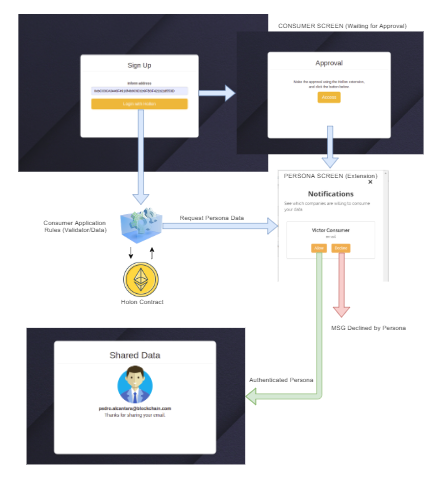

<p align="center">
  
</p>

<p>
  <strong>Holon</strong> is a project to manage your identity in a decentralized way. The protocol was create to save user's data in blockchain and give the power to the <i>user to control they own data</i>. This is a open source project, so this web app is a example of protocol aplication. <strong>Consumers</strong> can be big companies or anyone who wants to need use Holon user data.
They request the information then Holon user receive a notification and can allow or decline the request.
The base of this extension are smart contracts, created to save and manage the user's data and relationship between users, validators and consumers.
</p>

<p align="center">
  
</p>

### User Story

- As a 	Consumer
- I can choose trusted Validators.
- I can target the information that I really need to access my app.
- I can request the Persona's data and wait for the approval to authenticate
- I can offer or pay to customers or validators
So that I can own a new Business Model using Holon.

### Behaviour

Our example of usability:
- As I am a Persona using a Login with Holon
- I am at the Consumers login page
- When I selected the Login With Holon option
- I receive a notification to allow access to my personal information 

## Pre Requirements

- It is necessary install [Node](https://nodejs.org/en/) and [Npm](https://www.npmjs.com/).

## How to Install

To install in developer mode, follow the step-by-step:
1. Download the repository on your computer. 
2. Access the directory where you downloaded this project and run the command below.

```sh
  $ npm install
```

## How to Run

Run the command below to start project.

```sh
 $ npm start
```

## Tech
To build this application was used:

 Technologies | Version |
 ------ |------|
  React | 16.8.6 |
  Bootstrap | 3.3.7 |
  Babel | 7.4.5 |
